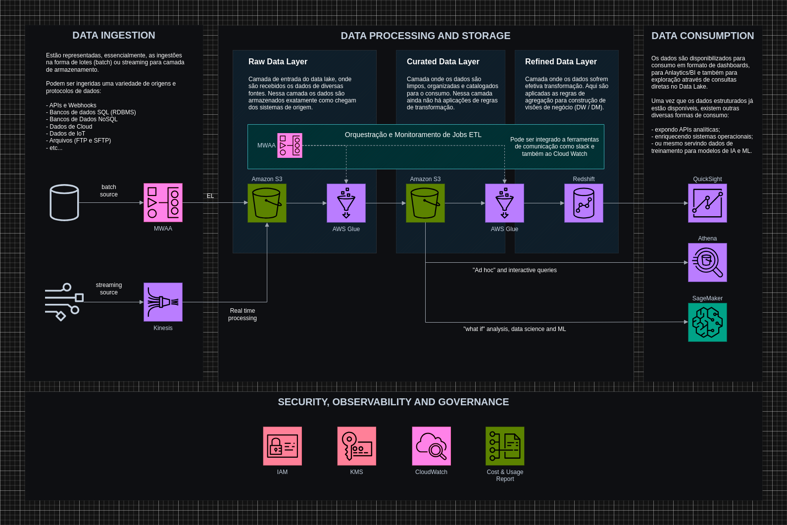

# Desafio Solfácil - Sr. Data Engineer

O teste sugerido está descrito abaixo e consiste em 3 partes principais:

1. Desenho da arquitetura
2. Descrição da arquitetura
3. Construção de uma DAG

## 1. Desenho da arquitetura

### Cenário:

_Dentro do domínio de customer existe uma aplicação que manipula dados em uma tabela chamada "Usuários" a uma taxa de 150.000 registros por dia. A manipulação consiste na atualização dos registros, inserção e deleção dos mesmos, além dos acessos de leitura. Durante o horário de mais uso da aplicação do customer, o banco de dados tem sofrido com locks que acabam acarretando em demora na pesquisa e impactando na experiência dos nossos clientes enquanto usam a plataforma da Solfácil._

_Descobriu-se que a concorrência no banco tem sido proveniente de acessos onerosos das equipes de áreas que estão rodando relatórios pesados durante estes horários e como medida de proteção da experiência do nosso cliente, todos os relatórios e acessos que não sejam da aplicação principal foram removidos._

_As áreas de negócio agora precisam de um novo ambiente para acessar os dados, de modo que os relatórios não interfiram na boa experiência do usuário. Este novo ambiente não pode mais ser apenas um banco de dados e nós precisamos sugerir uma arquitetura de dados, um data lake para resolver este problema e prover os dados para as áreas interessadas, criando um ambiente seguro, robusto, escalável e que mantenha as melhores práticas de governança, além de um custo viável para a operação._

### Tarefa:

> Desenhe uma proposta de arquitetura de forma que seja feita a ingestão em “real time” deste banco de dados do customer para o data lake.

* Sugestão de ferramenta para o desenho da arquitetura: [diagrams.net](https://app.diagrams.net/).

* Se possível, dê preferência à soluções AWS.

### Solução Elaborada:

O desenho de arquitetura também está [disponível pelo draw.io nesse link](https://drive.google.com/file/d/1KHcgpi2JiE9O0LRLB60TOnQK7JeWe5pC/view?usp=sharing).

## 2. Descrição da arquitetura

> Descreva a arquitetura desenvolvida acima explicando suas decisões. Caso tenha sugerido alguma tecnologia ou ferramenta, explique de forma resumida porque devemos utilizá-las.

### Solução Elaborada:

#### Data Ingestion: zona de aquisição dos dados no Data Lake.

- **MWAA (Managed Workflows for Apache Airflow)**: 
  Solução que executa o Apache Airflow de forma gerenciada. Esse serviço pode ser aplicado para execução de cargas de trabalho em lote (batch), extraindo e carregando dados em um bucket S3 de destino. O Airflow conta com uma série de conectores e pode ler uma diversidade de bancos de dados (relacionais e não relacionais), arquivos e outras fontes, aplicando pipelines de carga agendados. É importante ressaltar que, nas leituras de RDBMS, para evitar os _LOCKS_ em bases de dados transacionais, de produção, o Airflow deverá ler bancos de dados de réplicas, sendo essas réplicas somente leitura ou geradas por mecanismos de CDC. 

- **Kinesis**: 
  Serviço destinado ao fluxo de dados em streaming. Ele foi incluído na arquitetura pensando em consumo de dados oriundos de filas e mensagerias como o Kafka, SQS, SNS, RabbitMQ ou outros sistemas modelo pub/sub de tópicos. O Kinesis também pode ser uma boa opção para ingerir dados vindo de fluxos real time de dispositivos IoT.

#### Data Processing and Storage: zona de processamento de dados

###### Raw Data:
- **Amazon S3**: 
  Serviço de armazenamento gerenciado, onde os componentes da camada de ingestão gravam os dados. Essa é uma área onde os dados ingeridos são armazenados da mesma forma que foram extraídos, sem qualquer modificação.

- **AWS Glue**: 
  Serviço de processamento serverless da AWS que é usado nessa camada para executar os primeiros processos de tratamento, organização e limpeza dos dados que chegam das diversas origens. O Glue foi pensado aqui pois pode ser acionado para ambos os fluxos de ingestão: batch ou streaming. Ele pode iniciar ao receber um gatilho de criação de arquivo no bucket S3 quando um arquivo é recebido a partir de uma gravação do Kinesis. Ou pode ser acionado através de API, pelo MWAA (Apache Airflow) para executar os jobs de forma agendada.

###### Curated Data:
- **Amazon S3**: 
  O S3 foi novamente utilizado na camada curated partindo do mesmo racional técnico de armazenamento de arquivos usado para a camada anterior. A diferença é que nesse bucket S3 já existirá uma organização em diretórios dos arquivos “.parquet” particionados.

- **AWS Glue**: 
  Também foi baseado no mesmo racional técnico da camada anterior, isto é, por ser um serviço gerenciado serverless e acionado por ambos os fluxos de ingestão, podendo executar orientado a eventos ou agendado. Nesse caso, o foco dos jobs glue na camada curated, será aplicar as regras de preparação e agregação para a camada a seguir, a refined.

###### Refined Data:
- **AWS Glue**: 
  Parte do trabalho do Glue será entre a camada curated e refined. Aqui ele tratará os dados para que sejam agregados conforme regras de negócio para criação de tabelas resultado consolidadas.

- **Redshift**: 
  Serviço de data warehouse gerenciado que foi aplicado na arquitetura com intuito de armazenar as tabelas transformadas e ser o motor SQL de consulta dos dados refinados já preparados para o consumo, principalmente por possuir um melhor desempenho com consultas oriundas de Dashboards.

#### Data Consumption: stage de consumo dos dados disponibilizados no Lake.

- **QuickSight**: 
  Serviço de Visualização de Dados, onde serão construídos os painéis de BI e dashboards analíticos.

- **Athena**: 
  Foi incluído para possibilitar consultas interativas com SQL ANSI diretamente na camada curated, possibilitando algumas ações de exploração de dados sem necessariamente estar vinculado a regras de negócio já previamente definidas.

- **SageMaker**: 
  É um serviço que possibilita o trabalho de análise avançada de dados e data science com diversos componentes que habilitam o trabalho e deploy de modelos de ML. Foi incluído na arquitetura pensando em uma abordagem de dados para análises preditivas ou ações voltadas para IA.

#### Security, Observability and Governance: pilares de gestão da arquitetura

- **IAM (Identity and Access Management)**: 
  Destinado a criação de Roles, permissões e políticas de acessos aos recursos que envolvem o Data Lake por parte dos usuários e aplicações.

- **KMS (Key Management Service)**: 
  Serviço de gerenciamento de credenciais. Especialmente importante para armazenar e versionar de forma segura as chaves de conexão do MWAA com as origens de dados, por exemplo, como tokens e secrets de APIs e/ou senhas de bancos de dados.

- **CloudWatch**: 
  Serviço de monitoramento que auxilia no estudo de logs de execuções e também na criação de alertas de falhas.

- **Cost and Usage Report**: 
  Serviço que habilita a gestão do custo dos serviços aplicados na arquitetura, podendo ser integrado com S3 para geração de reports customizados.

## 3. Construção de uma DAG com o Airflow

> Construa uma DAG com o Apache Airflow que consulte a API pública [Disney API](https://disneyapi.dev/docs) e poste os dados a cada 5 minutos no data lake desenvolvido acima.

* Gere alguma transformação no dado de uma camada para outra, como por exemplo um dado gerado pela junção de dois outros da camada anterior.

* Acrescente algum tratamento para mascaramento deste dado entre uma camada e
outra.